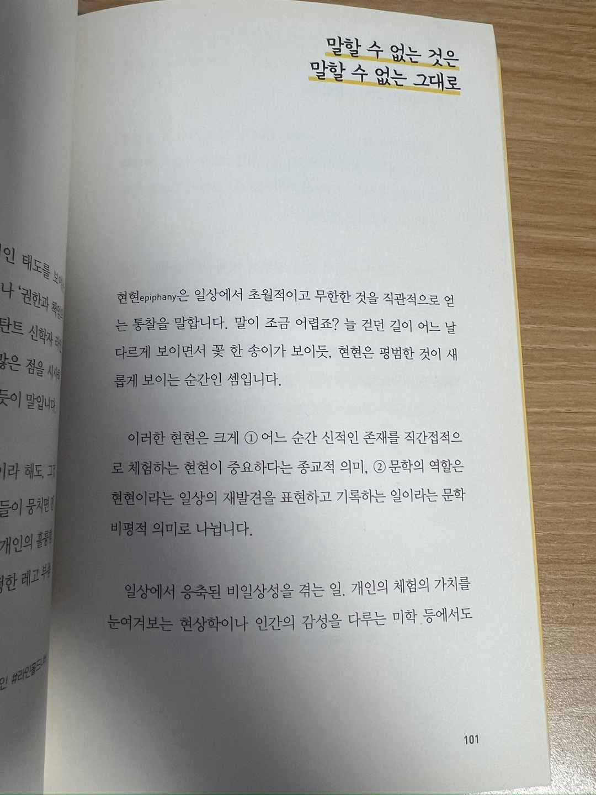
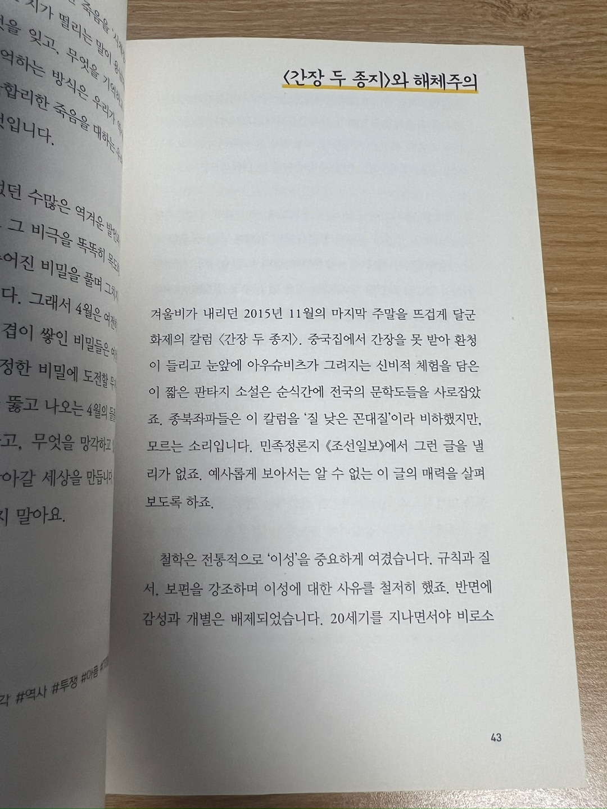
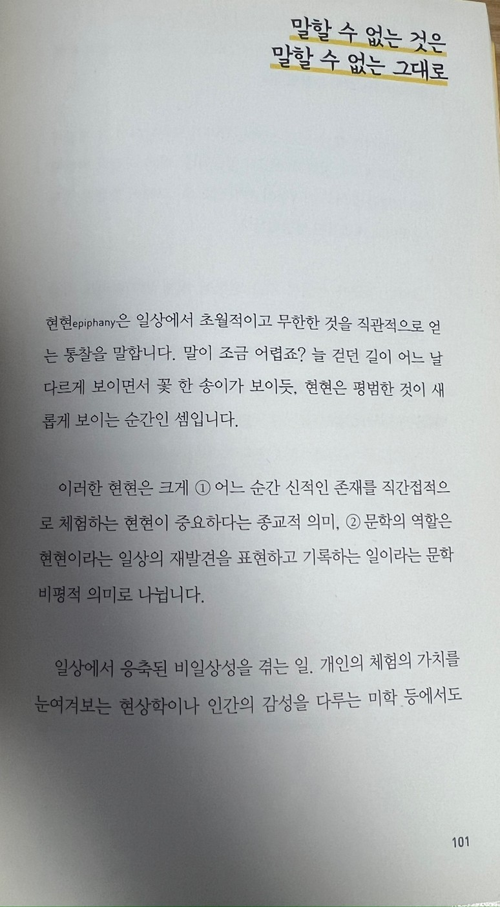
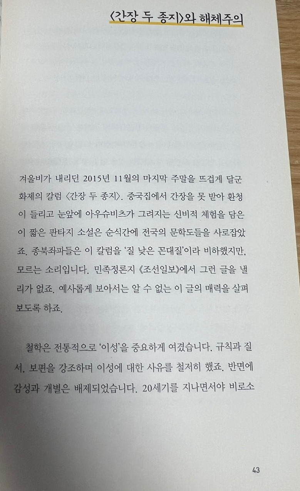

# OCR 적용

## 1. 원본 이미지 #1
### 이미지


### JSON 결과
```json
{
  "pages": [
    {
      "index": 0,
      "markdown": "# 말할 수 없는 것은 말할 수 없는 그대로\n\n현현(epiphany)은 일상에서 초월적이고 무한한 것을 직관적으로 얻는 통찰을 말합니다. 말이 조금 어렵죠? 늘 걷던 길이 어느 날 다르게 보이면서 꽃 한 송이가 보이듯, 현현은 평범한 것이 새롭게 보이는 순간인 셈입니다.\n\n이러한 현현은 크게 (1) 어느 순간 신적인 존재를 직간접적으로 체험하는 현현이 중요하다는 종교적 의미, (2) 문학의 역할은 현현이라는 일상의 재발견을 표현하고 기록하는 일이라는 문학 비평적 의미로 나뉩니다.\n\n일상에서 응축된 비일상성을 겪는 일. 개인의 체험의 가치를 눈여겨보는 현상학이나 인간의 감성을 다루는 미학 등에서도",
      "images": [],
      "dimensions": {
        "dpi": 200,
        "height": 1400,
        "width": 774
      }
    }
  ],
  "model": "mistral-ocr-2505-completion",
  "document_annotation": null,
  "usage_info": {
    "pages_processed": 1,
    "doc_size_bytes": 199421
  }
}
```


## 2. 원본 이미지 #2
### 이미지


### JSON
```json
{
  "pages": [
    {
      "index": 0,
      "markdown": "말할 수 없는 것은 말할 수 없는 그대로\n\n| '인 태노을\n나 '권한과 행\n탄트 신학자\n같은 잠을 자\n듯이 말입니다.\n이라 해도 고\n들이 뭉치면\n개인의 중\n정한 레고'와 | 현현epiphany은 일상에서 초월적이고 무한한 것을 직관적으로 얻 는 통찰을 말합니다. 말이 조금 어렵죠? 늘 걷던 길이 어느 날 다르게 보이면서 꽃 한 송이가 보이듯, 현현은 평범한 것이 새롭게 보이는 순간인 셈입니다.\n\n이러한 현현은 크게 (1) 어느 순간 신적인 존재를 직간접적으 로 체험하는 현현이 중요하다는 종교적 의미, (2) 문학의 역할은 현현이라는 일상의 재발견을 표현하고 기록하는 일이라는 문학 비평적 의미로 나뉩니다.\n\n일상에서 응축된 비일상성을 겪는 일. 개인의 체험의 가치를 눈여겨보는 현상학이나 인간의 감성을 다루는 미학 등에서도",
      "images": [],
      "dimensions": {
        "dpi": 200,
        "height": 1440,
        "width": 1080
      }
    }
  ],
  "model": "mistral-ocr-2505-completion",
  "document_annotation": null,
  "usage_info": {
    "pages_processed": 1,
    "doc_size_bytes": 424314
  }
}
```

## 3. 크롭 이미지 #1
### 이미지

```json
{
  "pages": [
    {
      "index": 0,
      "markdown": "# 말할 수 없는 것은 말할 수 없는 그대로 \n\n현현epiphany은 일상에서 초월적이고 무한한 것을 직관적으로 얻 는 통찰을 말합니다. 말이 조금 어렵죠? 늘 걷던 길이 어느 날 다르게 보이면서 꽃 한 송이가 보이듯, 현현은 평범한 것이 새롭게 보이는 순간인 셈입니다.\n\n이러한 현현은 크게 (1) 어느 순간 신적인 존재를 직간접적으 로 체험하는 현현이 중요하다는 종교적 의미, (2) 문학의 역할은 현현이라는 일상의 재발견을 표현하고 기록하는 일이라는 문학 비평적 의미로 나뉩니다.\n\n일상에서 응축된 비일상성을 겪는 일. 개인의 체험의 가치를 눈여겨보는 현상학이나 인간의 감성을 다루는 미학 등에서도",
      "images": [],
      "dimensions": {
        "dpi": 200,
        "height": 1400,
        "width": 774
      }
    }
  ],
  "model": "mistral-ocr-2505-completion",
  "document_annotation": null,
  "usage_info": {
    "pages_processed": 1,
    "doc_size_bytes": 199421
  }
}
```


## 3. 크롭 이미지 #2


```json
{
  "pages": [
    {
      "index": 0,
      "markdown": "# 〈간장 두 종지〉와 해체주의 \n\n겨울비가 내리던 2015년 11월의 마지막 주말을 뜨겁게 달군 화제의 칼럼 〈간장 두 종지〉. 중국집에서 간장을 못 받아 환청 이 들리고 눈앞에 아우슈비츠가 그려지는 신비적 체험을 담은 이 짧은 판타지 소설은 순식간에 전국의 문학도들을 사로잡았 죠. 종북좌파들은 이 칼럼을 '질 낮은 꼰대질'이라 비하했지만, 모르는 소리입니다. 민족정론지 《조선일보》에서 그런 글을 낼 리가 없죠. 예사롭게 보아서는 알 수 없는 이 글의 매력을 살펴 보도록 하죠.\n\n철학은 전통적으로 ‘이성’을 중요하게 여겼습니다. 규칙과 질 서, 보편을 강조하며 이성에 대한 사유를 철저히 했죠. 반면에 감성과 개별은 배제되었습니다. 20 세기를 지나면서야 비로소",
      "images": [],
      "dimensions": {
        "dpi": 200,
        "height": 1271,
        "width": 779
      }
    }
  ],
  "model": "mistral-ocr-2505-completion",
  "document_annotation": null,
  "usage_info": {
    "pages_processed": 1,
    "doc_size_bytes": 194259
  }
}
```